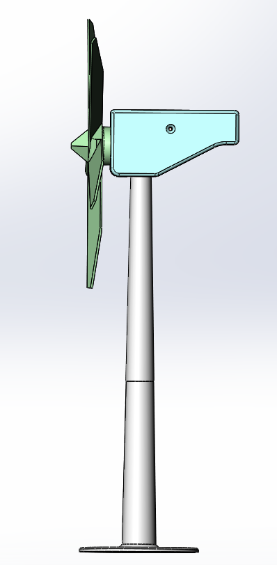
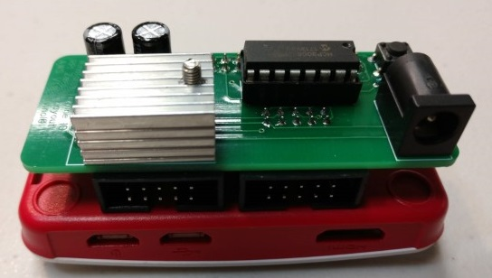

# Windfarm Turbine

### Description:
The turbine has a 3 part spinning airfoil connected to a DC motor that acts as a generator whos voltage is measured using an analog to digital converter. Rotation speed is measured using a hall effect sensor and magnet on the backside of the rotor assembly. Temperature of the generator is measured by a sensor placed adjacent to it. Vibraton of the turbine is measured using a 3-axis accelerometer. There is also a RGB LED mounted on top that provides a visual indication of status and safety condition. Finally, there is a mini-servo with a small arm that acts as a physical brake that can be activated to stop the rotation of the turbine when commanded to do so. THe 12 volt power supply is regulated down to 5 volts to provide power to the servo.

   

### Parts
* 1 [Raspberry PI Zero W](https://www.amazon.com/CanaKit-Raspberry-Wireless-Complete-Starter/dp/B072N3X39J/ref=sr_1_7?ie=UTF8&qid=1539961324&sr=8-7&keywords=raspberry+pi+zero+w)
* 1 40-pin male header (2x20)
* 1 40-pin female header (2x20)
* 1 Connector and analog/digitial converter shield (see below)
* 1 #6 Wood screw 0.5 inch
* 1 [DC motor](https://www.amazon.com/gp/product/B01I6MDXV6/ref=oh_aui_search_detailpage?ie=UTF8&psc=1)
* 1 [DS18B20 Temperature sensor](https://www.amazon.com/gp/product/B01IVN3X6K/ref=oh_aui_search_detailpage?ie=UTF8&psc=1)
* 1 [3144 Hall Effect Sensor](https://www.amazon.com/gp/product/B00ATNJH20/ref=oh_aui_search_detailpage?ie=UTF8&psc=1)
* 1 3mm x 3mm magnet
* 1 [RGB LED](https://www.amazon.com/gp/product/B01C19ENDM/ref=oh_aui_search_detailpage?ie=UTF8&psc=1)
* 1 [MCP3008 A/D Converter](https://www.amazon.com/gp/product/B01HGCSGXM/ref=oh_aui_search_detailpage?ie=UTF8&psc=1)
* 1 [L7805 Voltage regulator](https://www.amazon.com/MCIGICM-voltage-regulator-Regulator-Positive/dp/B07BDFMQF6/ref=sr_1_3?ie=UTF8&qid=1539962088&sr=8-3&keywords=7805+voltage+regulator)
* 1 [TO-220 Heatsink](https://www.amazon.com/gp/product/B0755ZZSD8/ref=oh_aui_search_detailpage?ie=UTF8&psc=1)
* 2 47 uF 50 volt electrolytic capacitors
* 2 100 ohm 1/8 watt resistors
* 1 150 ohm 1/8 watt resistor
* 1 10k ohm 1/8 watt resistor
* 1 4.7k ohm 1/8 watt resistor
* 1 1k ohm 1/8 watt resistor
* 1 PCB mounted momentary switch
* 1 PCB mounted DC connector jack
* 1 [12 volt power supply](https://www.amazon.com/gp/product/B07583C3ND/ref=oh_aui_search_detailpage?ie=UTF8&psc=1)
* 1 [Mini-Servo and servo arm](https://www.amazon.com/gp/product/B074SG74KV/ref=oh_aui_search_detailpage?ie=UTF8&psc=1)
* 1/4" and 1/8" Heat shrink
* 1 [LSM303DLHC 3-axis Compass Acceleration Sensor Module](https://www.amazon.com/gp/product/B06XH4RMGP/ref=oh_aui_search_detailpage?ie=UTF8&psc=1)
* 1 Connector board (see below)
* 2 [10-wire ribbon cables 24" long](https://www.amazon.com/gp/product/B007R9SQQM/ref=oh_aui_search_detailpage?ie=UTF8&psc=1)
* 2 4-wire JST-PH Connectors
* 3 3-wire JST-PH Connectors
* 1 2-wire JST-PH Connector
* 2 10-pin IDC connectors (straight)
* 2 10-pin IDC connectors (angled)

### Tools
* Hot glue and glue gun
* Soldering iron and Solder

### Instructions
Obtain or 3D print the parts for the turbine using the provided STL files:

* [Base and lower mast](models/mast_a.STL)
* [Upper mast](models/mast_b.STL)
* [Turbine housing](models/head.STL)
* [Housing cover](models/head_cover.STL)
* Hub and blades

Solder the 40 pin male header to the RPI on the BOTTOM SIDE. The shield is designed to mount below the RPI so that you can also use a camera on the front for future plans.

Solder parts to the two printed circuit boards as shown in pictures below. Solder the resistors first and ensure they are installed on the correct side.

Add 4" jumpers to each of the sensors and motor.

### Turbine Connection Board:

Both printed circuit boards can be requested from kevinol@ (limited supply) or you can take the provided gerber files and have them manufactured yourself.

 

#### Schematic

Printed Circuit Board (PCB)
Top

 

Bottom

 

### Raspberry PI Zero Shield:

 

#### Schematic

Printed Circuit Board (PCB)
Top

 

Bottom

 
