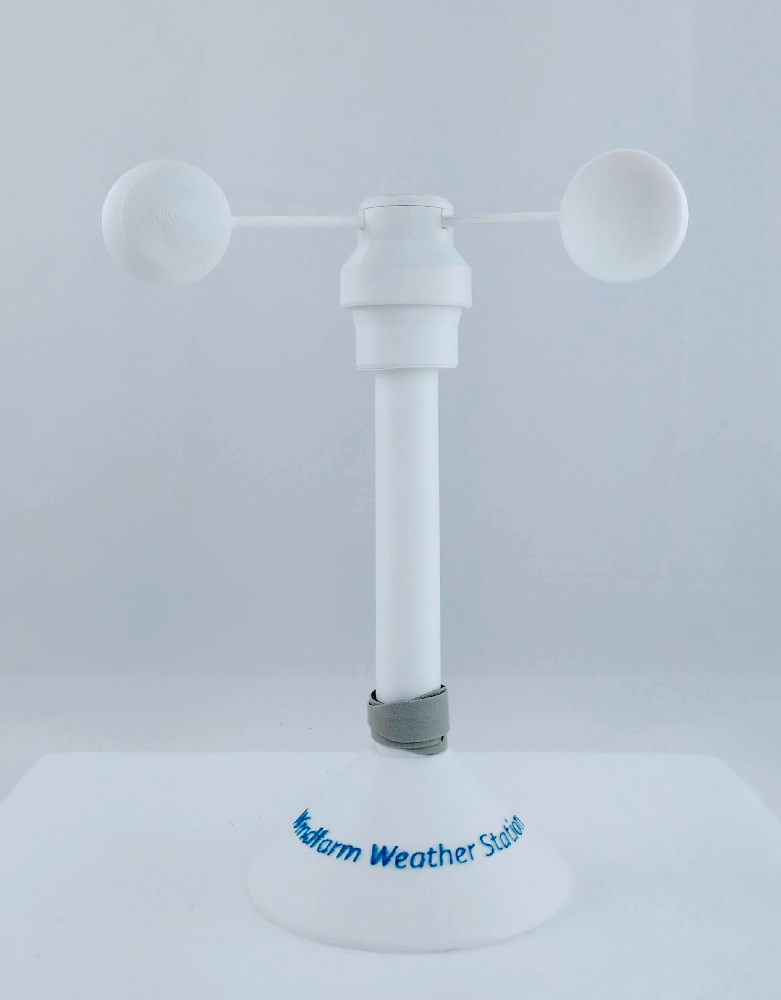

# Windfarm Weather Station

### Description:
The weather station is a 3d printed annemometer that uses a Hall effect sensor to measure rotations which are translated into miles per hour. The annemometer is conencted to a Raspberry PI using the GPIO header.

 

### Parts
* 3D Printed annemometer
* 1 [3144 Hall Effect Sensor](https://www.amazon.com/gp/product/B00ATNJH20/ref=oh_aui_search_detailpage?ie=UTF8&psc=1)
* 1 3mm x 3mm magnet
* 1 1/8 watt resistor
* 1/2" PVC Pipe 10" long
* Wood base for support

More to come...
